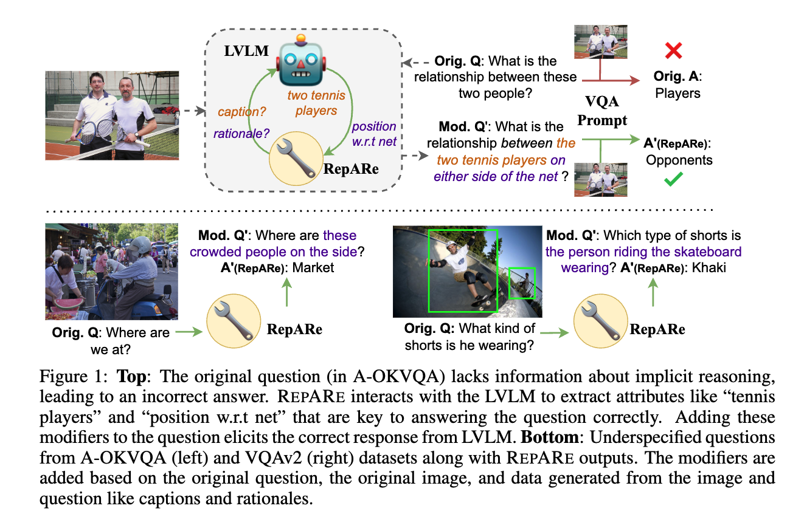
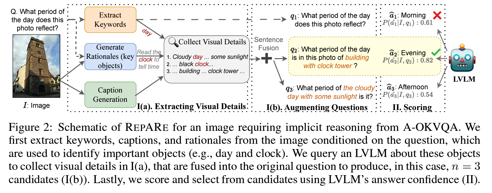

# Rephrase, Augment, Reason: Visual Grounding of Questions for Vision-Language Models
* Authors: [Archiki Prasad](https://archiki.github.io), [Elias Stengel-Eskin](https://esteng.github.io/), and [Mohit Bansal](https://www.cs.unc.edu/~mbansal/) (UNC Chapel Hill)
* [Paper](http://arxiv.org/abs/2310.05861)
* **Note:** This is preliminary version of our code. The complete code to run all experiments in the paper will be added shortly.



## Dependencies
This code is written using PyTorch, [HuggingFace's Transformer](https://github.com/huggingface/pytorch-transformers), and [Salesforce's Lavis](https://github.com/salesforce/LAVIS) repos. Loading large vision language models (LVLMs) within RepARe requires access to GPUs. We use Nvidia A6000 48 GB GPUs to load models with 8-bit quantization.

## Installation
The simplest way to run our code is to build separate conda environments for each LVLM architecture.

**For BLIP-2:**
```
conda create -n lavis python=3.8
conda activate lavis
cd Lavis
pip install -e .
```
**For MiniGPT-4:**
```
cd MiniGPT-4
conda env create -f environment.yml
conda activate minigpt4
```
**Note:** Please download the pretrained LLM weights and the pretrained MiniGPT-4 checkpoint from the [MiniGPT-4 repo](https://github.com/archiki/VQAPar/tree/main/MiniGPT-4) as per their instructions. You may also need to update local paths to datasets and model checkpoints in the corresponding `.yaml` files in `{Lavis/MiniGPT-4}/{lavis/minigpt4}/configs/` and `{Lavis/MiniGPT-4}/{lavis/minigpt4}/projects/{blip2/minigpt4}/`. Please also download the datasets (annotations folders) and specify the paths in the `.yaml` files in `{Lavis/MiniGPT-4}/{lavis/minigpt4}/configs/datasets/{coco/aokvqa}`.



## Running RepARe
Set the arguments in the `.yaml` files of each project in `{Lavis/MiniGPT-4}/{lavis/minigpt4}/projects/{blip2/minigpt4}/`. To set the number of candidates besides the original question *n-1* set `num_add_candidates`, to enable keyword extraction, set `keyword_pipeline: True`, and to use LVLM rationales set `reason: True`. To run the paraphrase baseline, only set `paraphrase: False` and to use the external paraphrase model set `ext_paraphrase: True`.

Here are some example run commands:

**For BLIP-2:**
```
cd Lavis
python evaluate.py --cfg-path lavis/projects/blip2/vqav2_zeroshot_flant5xl_eval.yaml
```
**For MiniGPT-4:**
```
cd MiniGPT-4
python evaluate.py --cfg-path minigpt4/projects/minigpt4/conv_vqav2.yaml
```

## Acknowledgements
We thank the authors and contributors of [BLIP-2](https://github.com/salesforce/LAVIS), and [MiniGPT-4](https://github.com/archiki/VQAPar/tree/main/MiniGPT-4) for their public code release. 

## Reference
Please cite our paper if you use our code in your works:
```bibtex

@article{Prasad2023RepARe,
  title         = {Rephrase, Augment, Reason: Visual Grounding of Questions for Vision-Language Models},
  author        = {Archiki Prasad and Elias Stengel-Eskin and Mohit Bansal},
  year          = {2023},
  archivePrefix = {arXiv},
  primaryClass  = {cs.CL},
  eprint        = {2310.05861}
}
```

